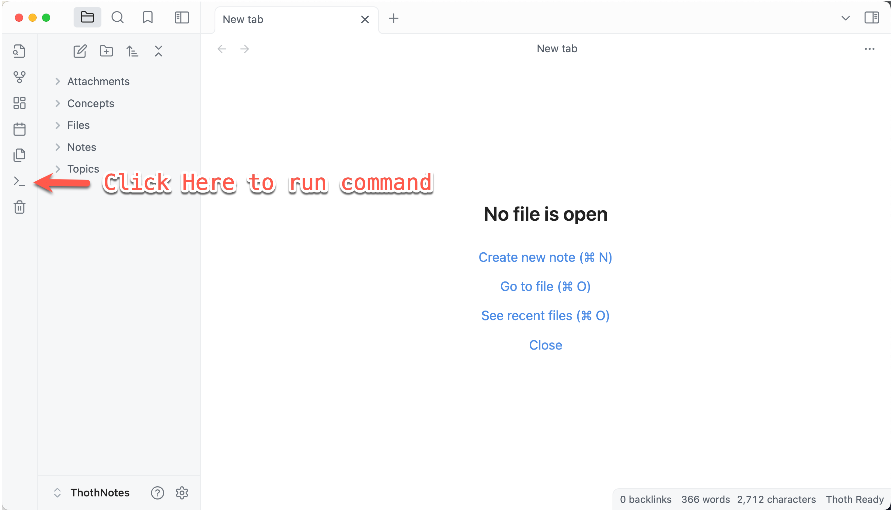
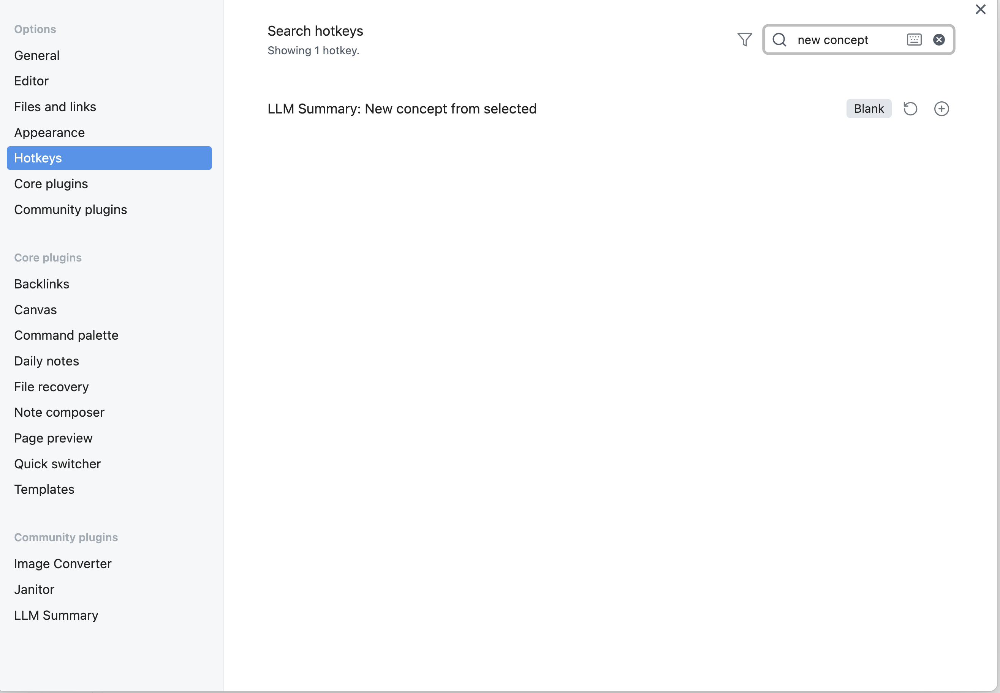

<h1 align="center">LLM Summary</h1>

<p align="center">Automate summary and concept defining in <a href="https://obsidian.md/">Obsidian</a>.</p>
<p align="center">
  
</p>


Minimize your efforts for lazy note-takers. Before your readings, summarize all PDF files in a folder to your vault with the power of LLMs (like GPTs from OpenAI). During your readings, define concepts to new *.MD notes and create a link to each.

Currently suits academic paper readings the best.

# Features

  - Summarize PDF Files: Automatically generate summaries for PDF files on batch using OpenAI’s GPT models. The summaries are structured in markdown with a recommended default structure.


  - Create New Concept Notes: Create new notes from selected text with a single command. The plugin will generate a markdown file with the selected text as the title.

# Installation

**Install Dependency**
- For MacOS users:
  Before installation, you can check your systemwide version of Python and Pip by using `which` command to determine pip or pip3 (Let's take pip3 for example).
  - Anaconda manager: `pip3 install openai, arxiv, pymupdf`
  - Homebrew manager: `pip3 install openai, arxiv, pymupdf --break-system-packages`

- For Windows users:
  Install by running `pip install openai, arxiv, pymupdf` in your terminal.

**OpenAI API Key Requested**: Before you start, you need an OpenAI API key to make LLM Summary function properly. Create one from [their website](https://platform.openai.com/api-keys) if you don't have one.

**Python Environment Requested**: You also need a functioning Python environment. Mac users have a default Python environment. And it's easy to setup on a Windows machine too.

**New Vault Recommended**: We recommend you start a new vault to avoid any possible conflicts since LLM Summary works on a specific folder setup.

Follow these steps to install from the official Obsidian plug-in store:

  1. Search for "LLM Summary" in Obsidian's community plugins browser (click "settings...", then Community plugins)
  2. Enable the plugin in your Obsidian settings (click "Settings...", find "LLM Summary" under "Community plugins"-> "Installed plugins")
  3. Check the settings. Paste your OpenAI API Key into the first field. Change your expert field (default is ML) if you want. 
  4. Open command palette, and run "Initialize LLM Summary Folders" to build the working folders.
  


Follow these steps to install from github repo (npm requested):
  1. Clone the repository into your Obsidian plugins directory, usually located at `<VaultFolder>/.obsidian/plugins/`.
  2. Run `npm run dev` to start.
  3. Enable the plugin in Obsidian by navigating to Settings > Community Plugins and toggling on LLM Summary.
  3. Check the settings. Paste your OpenAI API Key into the first field. Change your expert field (default is ML) if you want. 
  4. Open command, and run "Initialize LLM Summary Notes Folders" to build the working folders.

Now you should have the folder structure like this:

```
- Attachments
- Concepts  // new concepts saved here
- Files
- - PDFs  // your pdf files to summary
- Notes  // summary notes saved here
- - Read
- Topics
```

Now you are good to go. We recommend the plugin [Image Converter](https://github.com/xryul/obsidian-image-converter) for image compressions.


  


# Usage

## Summary PDFs

You need to run the `summary_pdf_folder.py` script (find it in your plug-in folder). To use the summarization feature, first setup your OpenAI API Key for Python script, [full instructions from OpenAI](https://platform.openai.com/docs/quickstart/step-2-set-up-your-api-key):

### Setup API Key

#### For Mac Users

1. **Open Terminal**: You can find it in the Applications folder or search for it using Spotlight (Command + Space).

2. **Edit Bash Profile**: Use the command nano `~/.bash_profile` or `nano ~/.zshrc` (for newer MacOS versions) to open the profile file in a text editor.

3. **Add Environment Variable**: In the editor, add the line below, replacing `your-api-key-here` with your actual API key:

```
export OPENAI_API_KEY='your-api-key-here'
```

1. Save and Exit: Press Ctrl+O to write the changes, followed by Ctrl+X to close the editor.

2. Load Your Profile: Use the command source `~/.bash_profile` or source `~/.zshrc` to load the updated profile.

3. Verification: Verify the setup by typing `echo $OPENAI_API_KEY` in the terminal. It should display your API key.

#### For Windows Users

1. **Open Command Prompt**: You can find it by searching "cmd" in the start menu.

2. **Set environment variable in the current session**: To set the environment variable in the current session, use the command below, replacing `your-api-key-here` with your actual API key:

```
setx OPENAI_API_KEY "your-api-key-here"
```

This command will set the OPENAI_API_KEY environment variable for the current session.

1. **Permanent setup**: To make the setup permanent, add the variable through the system properties as follows:

- Right-click on 'This PC' or 'My Computer' and select 'Properties'.
- Click on 'Advanced system settings'.
- Click the 'Environment Variables' button.
- In the 'System variables' section, click 'New...' and enter OPENAI_API_KEY as the variable name and your API key as the variable value.

2. **Verification**: To verify the setup, reopen the command prompt and type the command below. It should display your API key: echo %OPENAI_API_KEY%


### Run Python Script to Summary

1. Copy your PDF Files to the Files/PDFs, and keep the file name the same as the paper's title (recommended not required).
2. Summarize PDF Files (you can set the API key by passing an argument). Run `python summary_pdf_folder.py`

This script will search for all PDF files, summarize them, and save the result into the output folder in your vault. The summary will be formatted with the following sections:

  - Problems to Solve
  - Previous Methods and Their Limitations
  - Our Theory and Methods and How We Solve Them
  - Experiments to Back Our Theory

You can change the pdf_folder, output_folder, or openai_api_key by passing arguments into the Python script. You can also automatically delete these PDF files by setting delete_pdf to True.

## Create New Concept Notes

  - Select the concept text you want to define
  - Open command palette, run "New concept from selected" and wait for the process (by checking status changes).

### Hotkey Setting

We strongly recommend setting a hotkey for this command to avoid interruptions during your reading. Click 'Settings...' -> 'Hotkeys', and search 'LLM Summary' to setup a hotkey for the 'New concept from selected' command.



This command will create a new markdown file in the Concepts folder with the selected text as the file name. 
